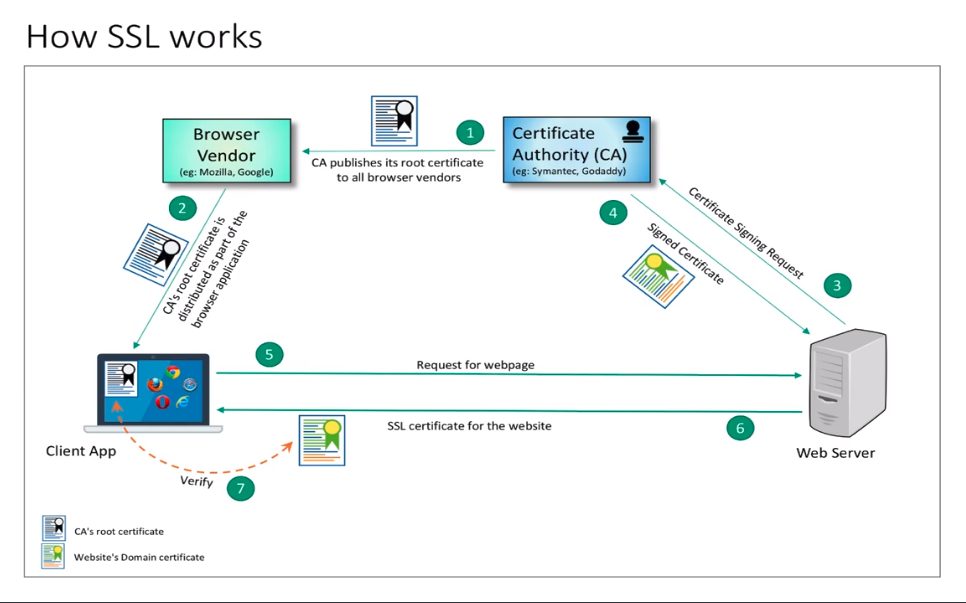

# Description: SSL Architecture

### SSL Parties
1. CA
2. Browser
3. Client
4. Server

### Steps in SSL Communication
1. CA Publishes its Root Certificate 
   - Certificate Authority (CA) publishes its public key to all internet application vendors (The browser vendors). 
   - CA is an organization/agency that signs SSL certificates for websites that wants to secure the access using SSL. 
   - Symantec, Geotrust, Thawt are some of the major CAs. 
   - CAs use public key infrastructure to cryptographically sign the certificates for the various requesting domains. 
   - A CA has its own key pair, ie a private key and a public key. The public-key is available for anyone. 
2. Browser Bundles the CA Root Certificates 
    - The browser vendors, such as Mozilla, Google, Microsoft, Apple etc. makes sure that all the browsers in the market 
      have a copy of all CAs public keys bundled as part of the application.
    - These public keys are made available in the form of public certificate/root certificate. 
    - These publick keys are necessary for a browser to verify the certificates signed by a particular CA. 
    - Anyone can view these certificates bundled with the browser.
3. Request for a Signed Certificate
    - In order to host a website and enable SSL one will have to find out a CA of choice and sends it a request. 
    - This request has many mandatory fields required to identify the host as the owner of the site. 
4. Get a Signed Certificate
    - On receiving a request for new certificate, the CA signs it. 
    - A digital signature is nothing but "the checksum of something encrypted with private key". In this case CA 
      calculates the checksum of the certificate and and encrypts the checksum using CA's private key that is known to 
      only the CA. 
    - On receiving the signed certificate from the CA, the system administrator of the webserver adds it to the 
      webserver configuration. 
    - This steps completes the one-time setup.
5.  Request for a Webpage
    - This is the step where the users come into picture. 
    - When someone access the website hosted on this webserver, the user's browser initiates an SSL connection.
6. SSL Certificate for the website
    - The webserver responds with SSL certificate for the domain/website. 
    - The browser then reads the CA that signed the certificate and uses the public key of that CA, that is stored in 
       browser's cert store to decrypt the signature to get the checksum string. 
    - It also calculate the checksum of the received certificate by itself and then compare the result with the 
      decrypted value of checksum. If they match, the verification is success and a Green PadLock is displayed. 
      Otherwise, a yellow padlock with a red cross on it is displayed.
7. Verify
    - Browser verifies the public key of the CA root certificate available in the browser. 

### TODO
* None
