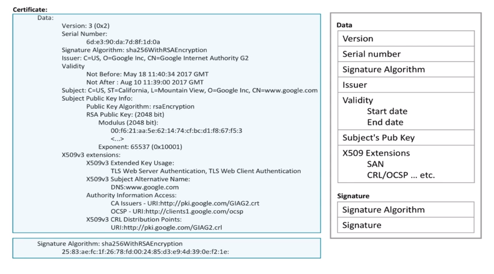
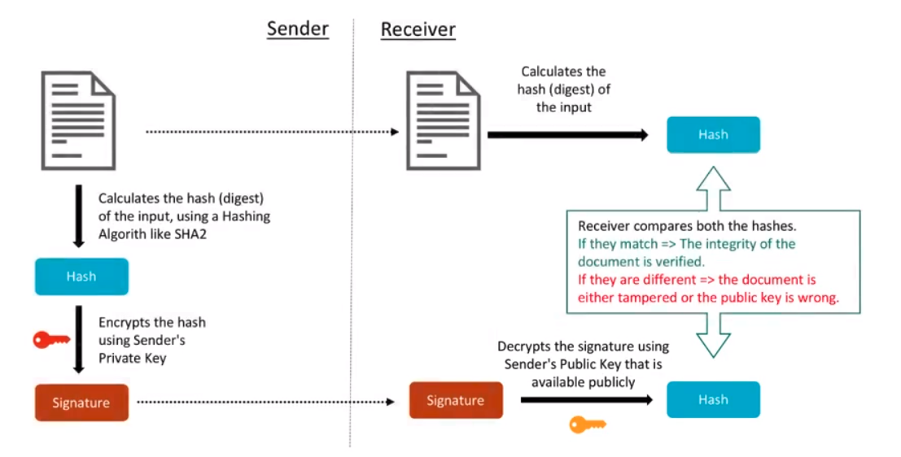

# Description: SSL Certificates

### CA Signed Vs Self Signed Certificates
|Sl No | CA Signed Certificate                                                      | Self Signed Certificates                                      |
|------|----------------------------------------------------------------------------|---------------------------------------------------------------|
|1.    | Signed by CA, a third party.                                               | Signed by website ,the Owner himself                          |
|2.    | Ideal for Public Use                                                       | Ideal for Closed Access                                       |
|3.    | Trusted by Browser who already have CA Root Certificate                    | Not trusted by Browser till the certificate is imported.      |
|4.    | Renewals/Modifications in certificate do not require browser side changes. | Renewal/modifications requires re-import of new certificates. |
|5.    | Bought from a CA                                                           | Free as it can be signed by oneself.                          |
|6.    | Leaf and Intermediate Certificates                                         | Root Certificates                                             |

### Viewing Certificates
* Using Firefox
    - Option 1: Go to Firefox - Edit - Preferences - Privacy & Security - Certificates - View Certificates - Authorities.
    - Option 2: Go to Preferences - Search for Certificates - View Certificates - Authorities.
* Using Chrome 
    - Option 1: Go to Chrome - Edit - Preferences - Advanced - Privacy and security - Manage Certificates. 
    - Option 2: Go to `chrome://settings/certificates` - Manage Certificates - Authorities.
* Using a generic Browser
    - Open website `https://google.com`
    - Click on Green/Amber/Red padlock
    - Procced to view a certificate 
* Using a Command Line Interface

```
# Get a domain's SSL Certificate Details
# - Use s_client to run in client mode
# - Use -connect to connect to a server
# - Specify domain name along with its SSL port 443
# - Redirect /dev/null to get a clean terminal output
openssl s_client -connect google.com:443 < /dev/null  

# Get a domain's SSL Certificate similar to Browser Format
# - Use x509 option to specify the certificate standard
# - Use -in /dev/stdin option to read the content from standard input
# - Use -text option to to display readable text content
# - Use -noout so that PEM certificate is not spitout
openssl s_client -connect google.com:443 < /dev/null | openssl x509 -in /dev/stdin -text -noout
```

### Architecture/Structure of SSL Certificate

* Data Section
    - Data section shows the content of the actual certificate.
    - Data section is provided by the website through a Certificate Signing Request (CSR).
    - Version number 3 under data section is the version of the X509 Certificate standard and not the SSL/TLS version. 
    - Serial number is used to revoke/change the certificate.
    - Signature algorithm is the algorithm used by CA to sign the certificate.
    - Validity is a date range.
    - Subject is the actual organisation to whom the certificate is issued.
    - Public key is the public key of the subject. It consists of modulus and exponent.
    - X509v3 Extensions are additional features of the certificates for extra security and advanced tasks.
        - Subject Alternative Name (SAN) is a list of domain names for which the certificate is applicable.If the 
          certificate is installed on any other domain, browser will show a warning.
        - Authority Information Access - CA Issuers: This is an URL to get intermediate CA certificates online.
        - Authority Information Access - OCSP: Open Certificate Stats Protocol or OCSP is a way to check the validity of 
          the certificate in case the owner has revoked a particular certificate. This is a protocol which responds to 
          just one revocation query for a particular serial number.
        - CA:False indicates it is not a root certificate. It will be True if it is a root certificate.
        - Certificate Revoke List (CRL) is another way to findout if the certificate is revoked by the owner. This will
          have all the entries revoked by a CA.
* Signature Section 
    - Signature section is added by the CA after signing the data section.
    - sha256withRSAEncryption specifies the SHA256 algorithm used to compute the checksum and RSA Private key encryption 
      used to sign the request.

### Digital Signature


* Digital signature is hash of something signed by private keys.
* Digital signature is verified using public keys.
* Digital Signature represented by red key checks the authentication of the sender.
* Digital Signature represented by yellow key checks the integrity of information.
* MD5, SHA1, SHA2 etc are some of the hasing functions.
* Applications of Digital Signature
    - SSL Certificates
    - Secure Email Communication
    - eDocuments or online orders
    - Watermarking

### Certificate Standards & Encoding Methods
* Standard 
    - X.509 (one of the ITU X.500 Directory standards) was chosen to be the certificate standard for SSL by NetScape.
    - SSL certificates are actually X.509 certificates.
    - In fact, x509 is the certificate standard for all PKIX as covered in RFC 6818.
* Encoding
    - Encoding standards of X.509 certificates or SSL certificates are DER and PEM.  
    - Distinguised Encoding Rules (DER) is a binary encoding standards generally stored in .cer or .crt files.
    - Privacy Enhanced Mail (PEM) is an ASCII (Base 64) encoding standard generally stored in .cer or .crt or .pem file.
* File Extensions    
    - The .crt file: Unix convention for binary encoded DER file or ASCII Base64 encoded PEM files.
    - The .cer file: Microsoft convention for binary encoded DER file or ASCII Base64 encoded PEM files.
    - The .key file: Public/Private PKCS#8 keys. DER or PEM.
* Encoding Conversion
    - Converting the certificate from DER to PEM does not change the content or the signature of the certificate.
    ```
    # Convert PEM encoded certificate to DER encoded certificate
    openssl x509 -in ServerCertificate.cer -outform der -out ServerCertificate.der
    
    # Convert DER encoded certificate to PEM encoded certificate
    openssl x509 -in ServerCertificate.der -inform der -outform pem -out ServerCertificate.pem
    ```
    
### Types of Certificates
* DV or Domain Validated Certificates
    - This type of certificate has the most basic trust level.
    - This type of certificate requires least amount of validation.
    - Validation is only against the domain. 
    - There is no paperwork involved to get this type of certificate.
    - It does not guarantee the identity of the website's owner or the actual existence of the organisation.
    - Validation process is through email, files and registrar.
    - Features
        * Shows only a green padlock
        * Cheapest of the 3 certificates.
        * Quick issuance within minutes.
        * 99.9% Mobile and Web Browser Validity.
        * Has wildcard and multi-domain features.
        * Can be re-issued as many times as needed during the validity period.
* OV or Organisation Validated Certificates
    - This type of certificate has business identity level trust.
    - Organisation name is printed on the certificate.
    - Features
        * Shows a green padlock
        * Takes 1-3 days for validation.
        * More trusted then DV
        * Organisation name is validated and part of certificate.
        * High 256-Bit encryption with 2048-bit key Length.
* EV or Extended Validated Certificates
    - This is the most trust level with maximum validation required.
    - This is used by trusted and high security sites like bank.
    - This is the most detailed certificate.
    - Features
        * Shows Green Padlock + Organisation Name + Green Address Bar
        * Takes upto 10 days for validation.
        * Strict validation process.
        * High 256-Bit encryption with 2048-bit key Length.
        * Multi-domain with SAN only
    
### TODO
* None
