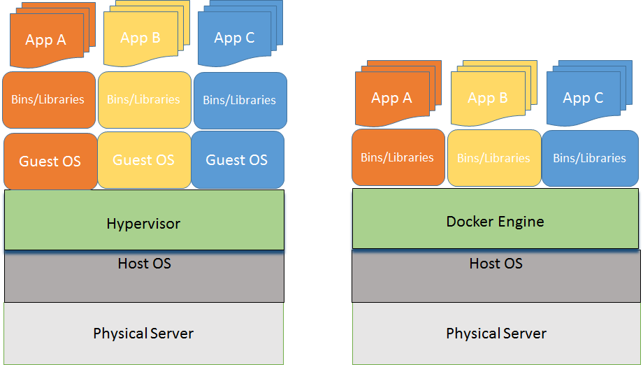
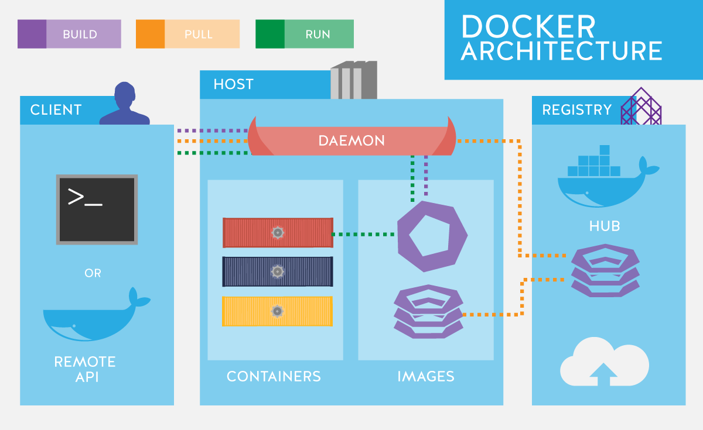
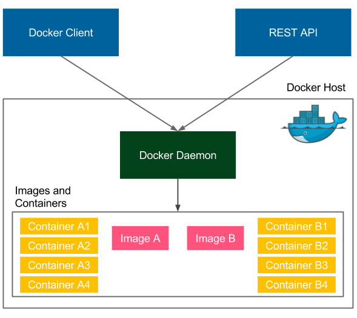
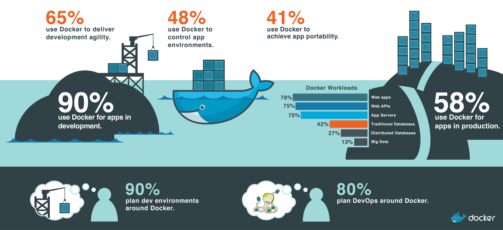

# Description: Docker Introduction

### Introduction
* Docker is a open source software that performs operating-system-level virtualization, also known as containerization.
* It was first released in 2013 by a company named Dot Cloud which later became Docker Inc.
* Docker is currently developed and maintained by Docker Inc.
* Docker is used to run software packages called "containers". Containers are isolated from each other and bundle their 
  own application, tools, libraries and configuration files. They can communicate with each other through well-defined 
  channels.
* All containers are run by a single operating-system kernel and are thus more lightweight than virtual machines. 
* Containers are created from "images" that specify their precise contents.
* Images are often created by combining and modifying standard images downloaded from public repositories.

### Docker Vs Virtual Machine
* Container are just processes.
* Containers are limited to what resources they can access.
* Container exit when the process stops.

### Docker on Linux Vs Docker on Windows

### Docker Architecture

### Docker Client Server Architecture

### Docker Components

### Shift to Docker
* 1990s: Mainframe to PC
* 2000s: Baremetal to Virtualisation
* 2010s: Datacenter to Cloud
* 2015s: Host to Container (Serverless)

### Docker Editions

* Docker CE
    - Docker CE: Docker Community Edition
    - Docker EE: Docker Enterprise Edition
* Docker CE
    - Docker Edge Releases
        - Released every month.
        - Supported for 1 month. 
        - Example v18.04, v18.05, v18.06, etc.
    - Docker Stable Releases 
        - Released every quarter 
        - Supported for 4 months. It gives 1 month to update to the latest.
        - Example v18.03, v18.06, v18.09, etc. 
* Docker EE
    - Docker Edge Releases
        - None
    - Docker Stable Releases 
        - Released every quarter 
        - Supported for 1 year. 

### How do People Use Docker

### TODO
* None
