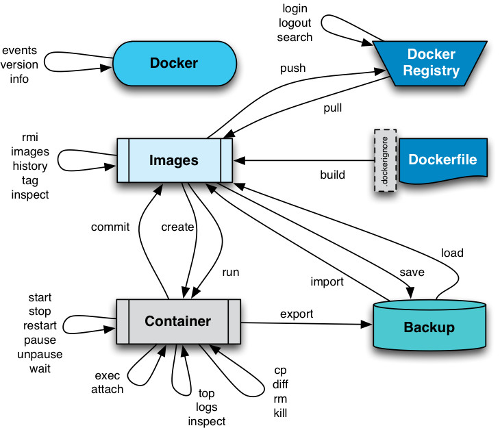

# Description: Docker Commands

### Docker Commandline Structure
* Old Style: `docker <command> [options]`
* New Style: `docker <command> <sub-command> [options]`

### Docker Commands Flow

### TODO
* None
