# Description: Vim Humour

### Note
* None

### VIM Humour
* Vim can replace IDE
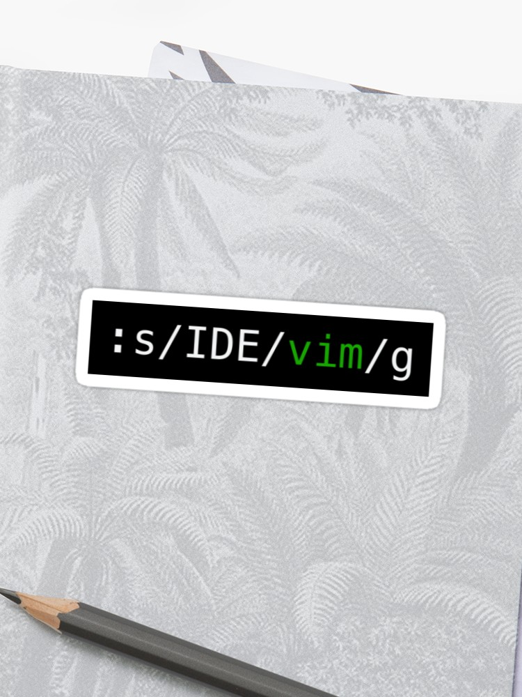

* Editing Vimrc File in Vim
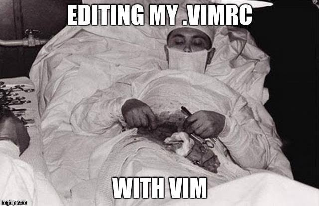

* Exiting Vim 
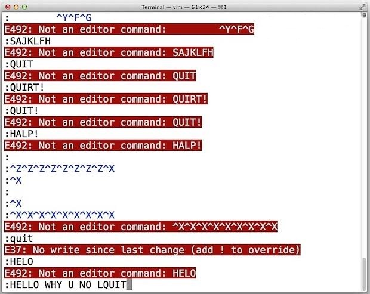

* Exiting Vim 
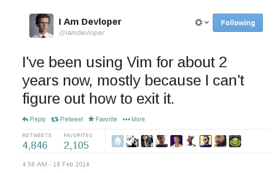

* Exiting Vim 
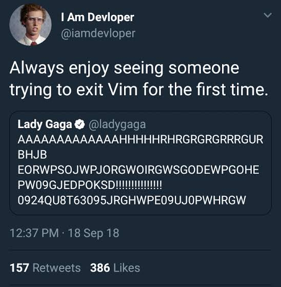

* Exiting Vim 
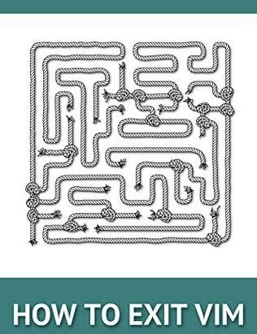

* Exiting Vim 
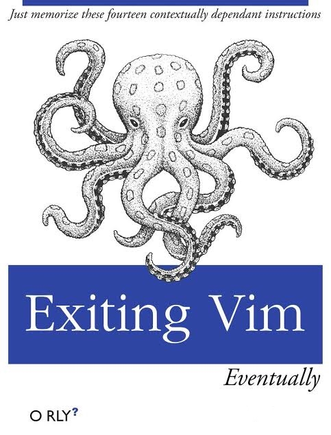

* Vim Keyboard Heatmap
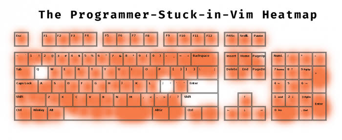

* Vim Learning Curve
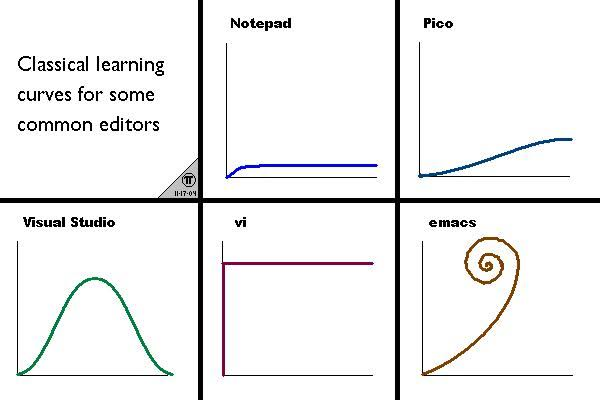

* Vim or Roman 6
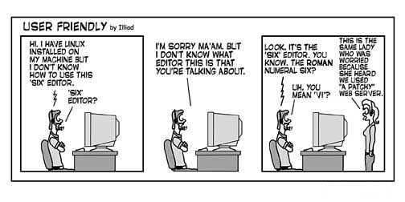

* Vim Random String
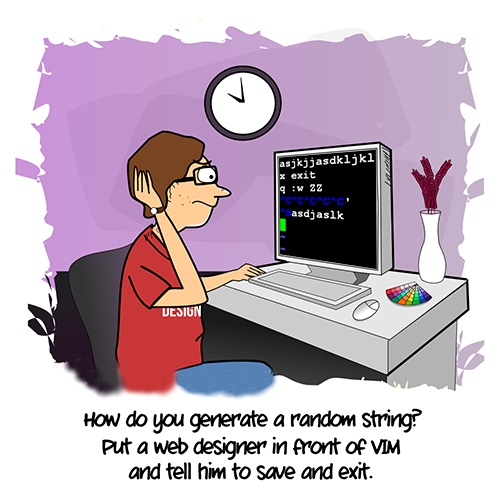

* Vim Vs Emacs
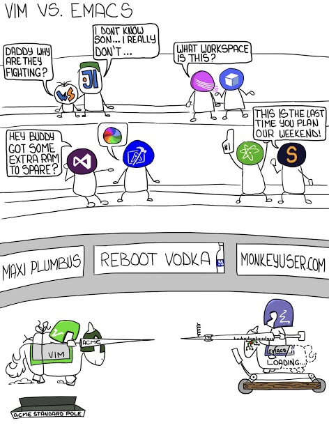

* Vim Vs Emacs Vs Nano
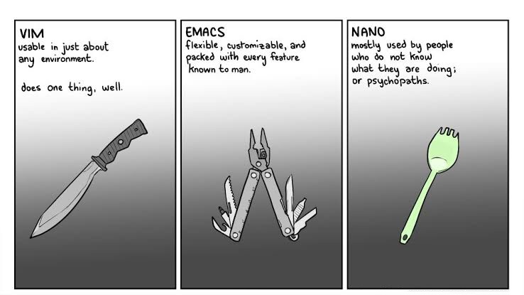
